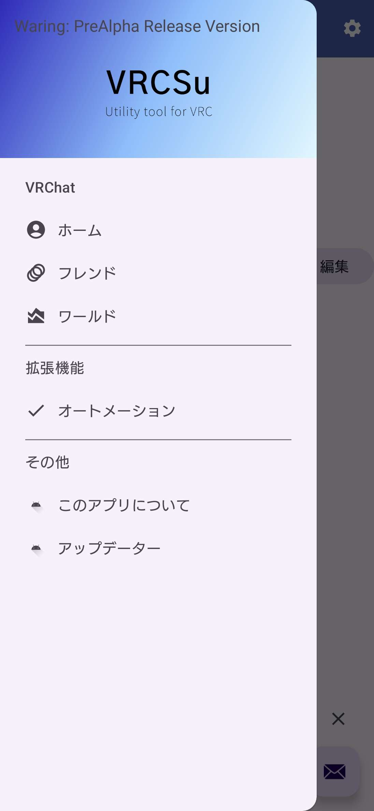
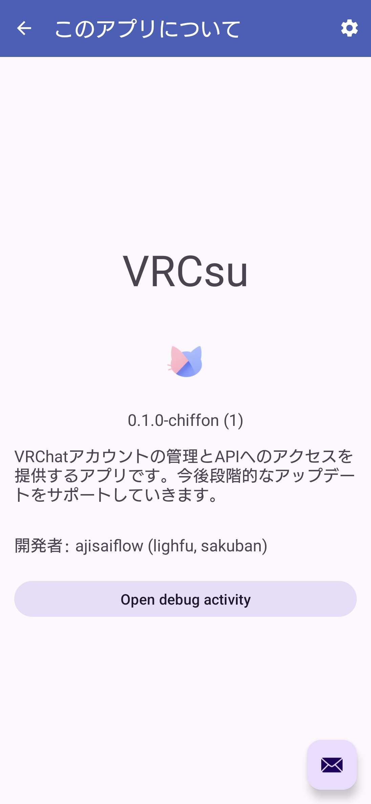
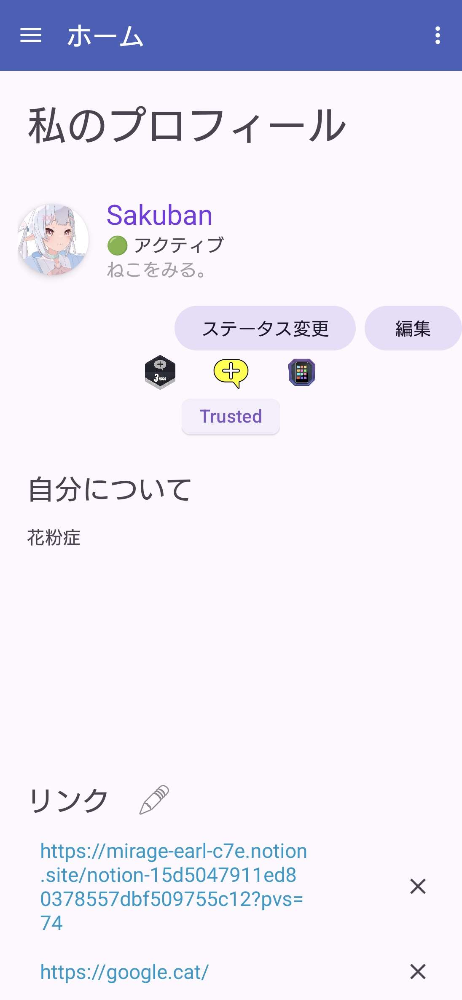
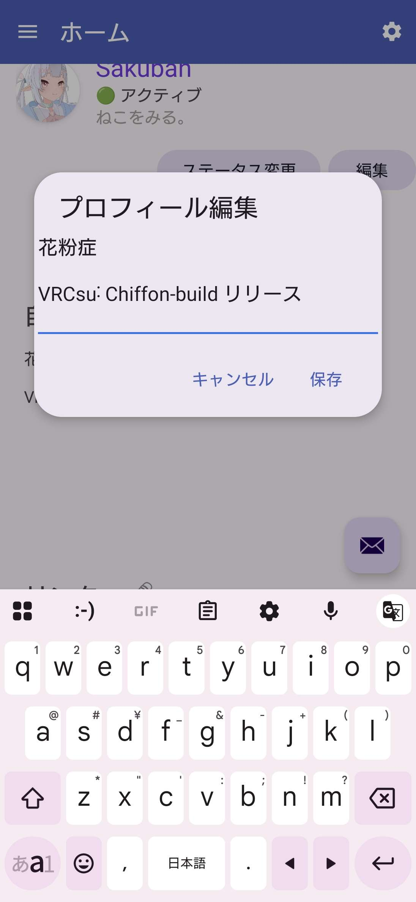
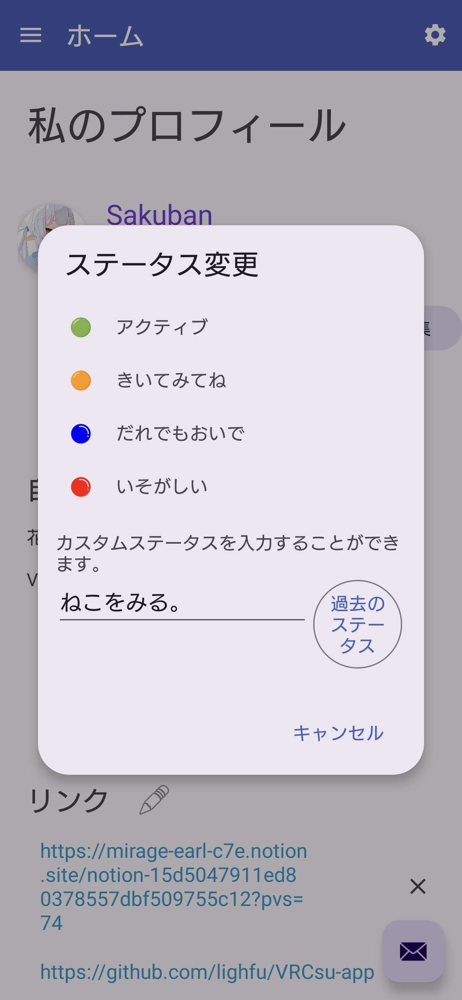

  

# VRCsu-app

Android用の VRChatに関わる様々なユーティリティーを利用できるアプリケーション

 
 

  **多言語ReadMe対応予定:**
   
  [English](link/to/README_en.md) | [日本語](link/to/README_ja.md) | [Español](link/to/README_es.md) | [Français](link/to/README_fr.md) | [Deutsch](link/to/README_de.md) | [中文](link/to/README_zh.md) | [한국어](link/to/README_ko.md) | [العربية](link/to/README_ar.md)
   
  

---

  
  
  
  
  
  

VRChat 向けのAndroid用小さなユーティリティツールです。

# バージョン

## v0.1.x-chiffon

- 内部的にデータベースが構築されています。
- 自身の情報を簡易的に編集できます。
- プライバシーポリシーと利用規約を厳格化しました。
- 試験的にフレンド一覧をみることができます。

## v0.2.x-chiffon (まだリリースされていません)

- STT機能の追加 (大目玉機能の一つ)
- ローカライズを徹底的に行いました。
- モバイルデータ節約のオプション追加
- 見えない努力をしました。

### 今後のアップデートをお楽しみに。

# Todo List
### https://www.notion.so/1ca5047911ed8011b3d3c13c2d94e775?pvs=4

  
# `chiffon` ビルドと `stable` ビルド

- `chiffon` ビルドは不安定なビルド`(Pre Aplha)`です。
予期しない動作をする可能性が大いにあります。
試験評価版に興味がある方はお試しください！

- `stable` は安定リリースになります。
Githubでは `stable` を使用することを強くオススメします。

# 注意 (アンインストールまたはデータ削除の際)
アプリをアンインストールする前に `このアプリについて` から `Open debug activity` を押して `ログアウト` してください。そうしないとセッションがしばらく残り続けます。

セッションが残り続けるとセッション数の上限に達して、アカウントにしばらくの間ログインできなくなる恐れがあります。