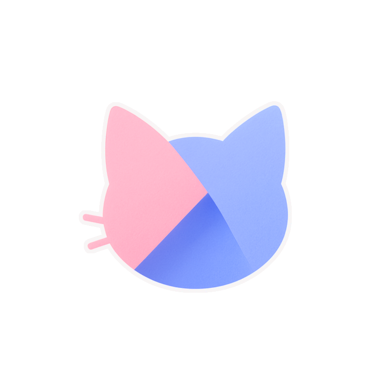

  

<h1 align="center">VRCsu-app</h1>

 
 

Eine Android-Anwendung, die verschiedene Dienstprogramme im Zusammenhang mit VRChat bereitstellt

 

Für alle VRChat-Nutzer

 
 
 

> [!WARNING]
> Die aktuelle Version enthält nur Chiffon-Builds (Vorabversionen), die möglicherweise nicht stabil funktionieren.

> [!TIP]
> Bevor Sie die App deinstallieren, gehen Sie bitte zu `Über diese App` und drücken Sie `Debug-Aktivität öffnen` und dann `Abmelden`. Wenn Sie dies nicht tun, bleibt Ihre Sitzung eine Weile aktiv.
>
> Wenn Sitzungen weiterhin aktiv bleiben, könnten Sie das Sitzungslimit erreichen und sich eine Zeit lang nicht mehr bei Ihrem Konto anmelden können.

 

    <a href="https://www.notion.so/1ca5047911ed8011b3d3c13c2d94e775?pvs=4">Entwicklungsfortschritt / Aufgabenliste</a>

---

  
  
  
  
  

 
 

## Versionen
 

* `v0.1.x-chiffon`

    - Intern wurde eine Datenbank aufgebaut.
    - Sie können Ihre eigenen Informationen einfach bearbeiten.
    - Datenschutzrichtlinie und Nutzungsbedingungen wurden verschärft.
    - Sie können experimentell Ihre Freundesliste einsehen.

* `v0.2.x-chiffon`

    - STT-Funktionalität hinzugefügt (eine der Hauptfunktionen)
    - Es wurde eine gründliche Lokalisierung durchgeführt.
    - Unterstützt 10 Sprachen.
    - Option zum Sparen von mobilen Daten hinzugefügt
    - Der Updater hat sich deutlich weiterentwickelt
    - Unsichtbare Anstrengungen wurden unternommen.

 

## Installation
 

Bitte laden Sie die neueste Version der APK aus dem Release-Bereich dieses Repositories herunter und installieren Sie sie. Wenn eine Viruswarnung erscheint, können Sie sie unabhängig davon installieren, ob Sie sie unter Quarantäne stellen oder nicht.

 

  

 

## Build
 

Diese Anwendung ist derzeit Closed-Source-Code und nicht Open-Source.

Builds sind separat signierte APKs und können nicht zwischen GooglePlay-Version und Github-Version verwechselt werden.

 

- `chiffon`-Builds sind instabile Builds `(Pre Alpha)`.
Sie können sich unvorhersehbar verhalten.
Wenn Sie an der Test-Evaluierungsversion interessiert sind, probieren Sie sie aus!

- `stable` wird die stabile Version sein.
Wir empfehlen dringend, `stable` auf Github zu verwenden. 