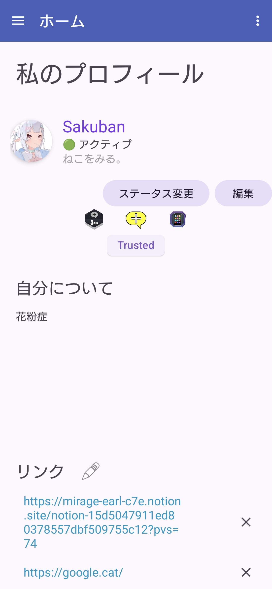
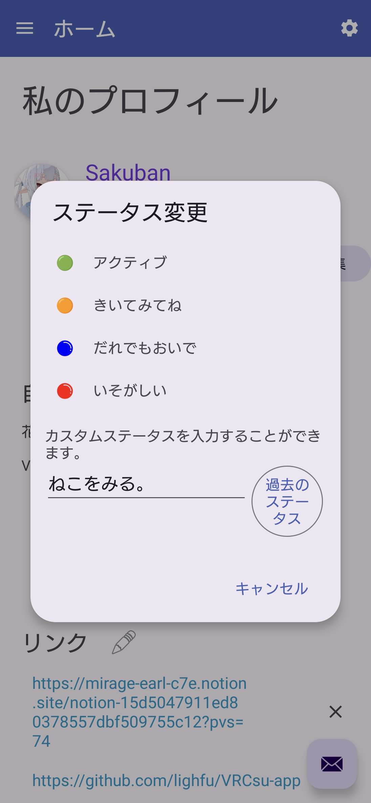

  

<h1 align="center">VRCsu-app</h1>

 
 

Una aplicación Android que proporciona diversas utilidades relacionadas con VRChat

 

Para todos los usuarios de VRChat

 
 

  <a href="README.md">日本語 (ja)</a> •
  <a href="README_en.md">English (en)</a> •
  <a href="README_ko.md">한국어 (ko)</a> •
  <a href="README_zh.md">中文 (zh)</a> •
  <a href="README_fr.md">Français (fr)</a> •
  <a href="README_ru.md">Русский (ru)</a> •
  <a href="README_pt.md">Português (pt)</a> •
  <a href="README_it.md">Italiano (it)</a> •
  <a href="README_de.md">Deutsch (de)</a>

 
 

> [!WARNING]
> La versión actual solo incluye compilaciones Chiffon (versión de pre-evaluación), que pueden no funcionar de manera estable.

> [!CAUTION]
> Antes de desinstalar la aplicación, vaya a `Acerca de esta aplicación` y presione `Abrir actividad de depuración` y luego `Cerrar sesión`. Si no lo hace, su sesión seguirá activa durante un tiempo.
>
> Si las sesiones continúan activas, es posible que alcance el límite de sesiones y no pueda iniciar sesión en su cuenta durante un tiempo.

 

    <a href="https://www.notion.so/1ca5047911ed8011b3d3c13c2d94e775?pvs=4">Estado de desarrollo / Lista de tareas</a>

---

  
  
  
  
  

 
 

## Versiones
 

* `v0.1.x-chiffon`: Primera versión de pre-evaluación

    - Se ha construido internamente una base de datos
    - Puede editar su información de manera simple
    - La política de privacidad y los términos de uso se han vuelto más estrictos
    - Se ha implementado experimentalmente la lista de amigos

* `v0.2.x-chiffon`: Adición de STT y localización a gran escala, y otros ajustes

    - Añadida la funcionalidad STT (una de las características principales)
    - Se ha realizado una localización exhaustiva
    - Compatible con 10 idiomas
    - Añadida la opción de ahorro de datos móviles
    - El actualizador ha evolucionado significativamente
    - Ajustes menores en el diseño de "Mi perfil"
    - Se han realizado esfuerzos invisibles

 

## Instalación
 

Descargue e instale la última versión del APK desde la sección Release de este repositorio. Si aparece una advertencia de virus, puede instalarlo ya sea que lo ponga en cuarentena o no.

 

  

 

## Compilación
 

Esta aplicación actualmente tiene código cerrado y no es de código abierto.

Las compilaciones son APKs firmados por separado y no se pueden confundir entre la versión de GooglePlay y la versión de Github.

 

- Las compilaciones `chiffon` son inestables `(Pre Alpha)`.
Pueden comportarse de manera inesperada.
Si está interesado en la versión de evaluación de prueba, ¡pruébela!

- `stable` será la versión estable.
Recomendamos encarecidamente usar `stable` en Github. 