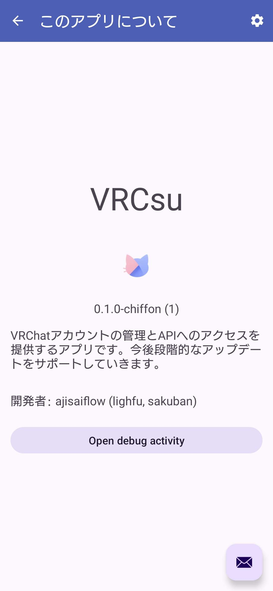

  

<h1 align="center">VRCsu-app</h1>

 
 

Une application Android qui fournit diverses utilités liées à VRChat

 

Pour tous les utilisateurs de VRChat

 
 
 

> [!WARNING]
> La version actuelle ne contient que des builds Chiffon (version pré-évaluation), qui peuvent ne pas fonctionner de manière stable.

> [!TIP]
> Avant de désinstaller l'application, veuillez aller dans `À propos de cette application` et appuyer sur `Ouvrir l'activité de débogage` puis sur `Déconnexion`. Si vous ne le faites pas, votre session restera active pendant un certain temps.
>
> Si les sessions continuent à rester actives, vous risquez d'atteindre la limite de sessions et de ne pas pouvoir vous connecter à votre compte pendant un certain temps.

 

    <a href="https://www.notion.so/1ca5047911ed8011b3d3c13c2d94e775?pvs=4">État du développement / Liste des tâches</a>

---

  
  
  
  
  

 
 

## Versions
 

* `v0.1.x-chiffon`

    - Une base de données a été construite en interne.
    - Vous pouvez modifier simplement vos propres informations.
    - La politique de confidentialité et les conditions d'utilisation ont été renforcées.
    - Vous pouvez consulter expérimentalement votre liste d'amis.

* `v0.2.x-chiffon`

    - Ajout de la fonctionnalité STT (une des fonctionnalités principales)
    - Une localisation approfondie a été mise en œuvre.
    - Prend en charge 10 langues.
    - Ajout d'une option d'économie de données mobiles
    - Le système de mise à jour a considérablement évolué
    - Des efforts invisibles ont été réalisés.

 

## Installation
 

Veuillez télécharger et installer la dernière version de l'APK depuis la section Release de ce dépôt. Si un avertissement de virus apparaît, vous pouvez l'installer que vous le mettiez en quarantaine ou non.

 

  

 

## Build
 

Cette application est actuellement en code source fermé et n'est pas open source.

Les builds sont des APK signés séparément et ne peuvent pas être confondus entre la version GooglePlay et la version Github.

 

- Les builds `chiffon` sont des builds instables `(Pre Alpha)`.
Ils peuvent se comporter de manière inattendue.
Si vous êtes intéressé par la version d'évaluation d'essai, essayez-la !

- `stable` sera la version stable.
Nous recommandons vivement d'utiliser `stable` sur Github. 